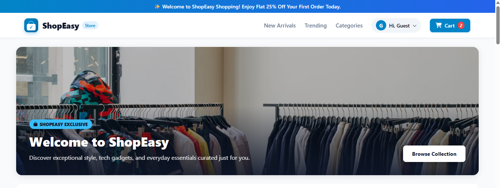
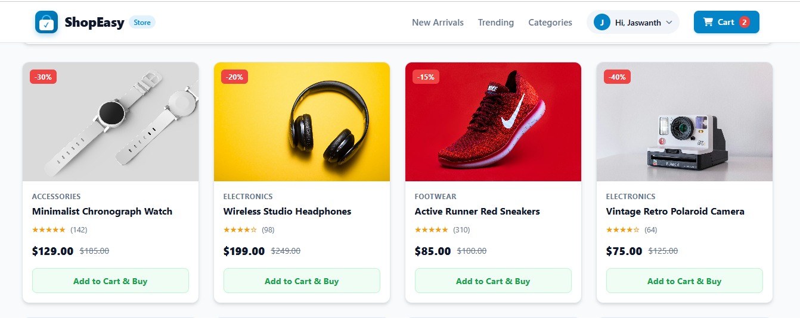
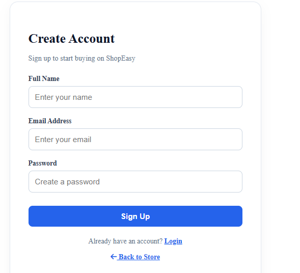

# ShopEasy — Online Store

**ShopEasy** is a responsive front-end e-commerce website built to demonstrate the main shopping journey: browsing products, searching and filtering the catalog, viewing product information, creating an account, signing in, managing a profile, and using a shopping cart.

- **Live demo:** https://shopeasy-onlinestore.netlify.app
- **GitHub repository:** https://github.com/Jaswanth-36/shopeasy-online-store
- **Developer:** Jaswanth Neerukattu

> **Project scope:** This is a learning/demo storefront. Product names and displayed prices are sample catalog data; they are not a live inventory or price feed. No real payment processing is claimed.

## Contents
- [Overview](#overview)
- [Features](#features)
- [Technology](#technology)
- [Project structure](#project-structure)
- [How the application works](#how-the-application-works)
- [Authentication and account pages](#authentication-and-account-pages)
- [Product catalog and filtering](#product-catalog-and-filtering)
- [Shopping cart](#shopping-cart)
- [Run locally](#run-locally)
- [Deployment](#deployment)
- [Screenshots and outputs](#screenshots-and-outputs)
- [Limitations and future improvements](#limitations-and-future-improvements)

## Overview
ShopEasy presents a typical online-store interface. Visitors can explore the catalog without signing in. Account-related pages provide signup, login, forgot-password, and profile experiences. Product detail and cart pages support the purchase flow demonstration.

The project focuses on the client-side experience and page navigation. The README does not assume a server-side database, payment gateway, or live product API unless one is added and configured separately.

## Features
- Store landing page with product cards and category navigation.
- Product search and category filtering.
- Product details page.
- Add-to-cart interaction and cart page.
- Signup and login interfaces.
- Forgot-password page/interface.
- Profile page.
- Cart count display in the store navigation.
- Product image assets.
- Responsive web layout for common screen sizes.
- Deployed demo on Netlify.

## Technology
- **HTML5** — page structure and semantic content.
- **CSS3** — layout, styling, and responsive presentation.
- **JavaScript** — catalog filtering, search, cart interactions, and client-side page behavior.
- **Browser storage** — client-side persistence where implemented.
- **Netlify** — published demo hosting.
- **Git/GitHub** — source control and project documentation.

## Project structure
The source project has been organized around the pages and scripts described below. If your local copy uses slightly different filenames, preserve its existing names when copying files.

```text
shopeasy-online-store/
├── index.html                 # Store home/catalog page
├── index.css                  # Main storefront styling
├── auth.js                    # Authentication-related client behavior
├── cart.html                  # Shopping cart page
├── cart.js                    # Cart behavior
├── product-detail.html        # Product information page
├── profile.html               # User profile page
├── login.html                 # Login page
├── login.css                  # Login styling
├── signup.html                # Signup page
├── signup.css                 # Signup styling
├── forgot-password.html       # Password reset interface
├── forgot-password.css        # Password reset styling
├── pichtml/                   # Product image assets
├── outputs/                   # Project screenshots / UI outputs
└── README.md                  # Project documentation
```

## How the application works

### 1. Storefront
The landing page displays product cards and navigation. A visitor can search for an item or select a category to narrow the displayed products. Each product card presents its image, name, price, and available action.

### 2. Product browsing
The catalog is organized into categories. Search and category controls help users locate items without manually scanning the full catalog. Selecting a product opens its detail page when that route is wired in the project.

### 3. Authentication flow
The project includes signup, login, forgot-password, and profile pages. These pages demonstrate the account journey from creating an account to accessing account details. Client-side checks improve the form experience, but **front-end-only authentication is not secure production authentication**. A real store should verify credentials on a backend, hash passwords server-side, manage sessions securely, and implement verified password reset.

### 4. Cart flow
When a user adds an item, the cart interaction records the selected product and updates the cart count. The cart page presents the chosen items and supports reviewing the cart. Browser storage can retain cart state between page visits if enabled in the implementation. A production cart should validate product IDs, prices, quantities, and stock on a server.

### 5. Deployment
The published demo is hosted on Netlify. For a static site, the HTML, CSS, JavaScript, and assets are deployed as site files. After pushing updates to the connected deployment source, Netlify can publish the changed site according to its deployment configuration.

## Authentication and account pages
The account UI includes:
- **Signup:** collect the details required by the signup form.
- **Login:** accept the user's login information.
- **Forgot password:** provide a password-recovery interface.
- **Profile:** show account-related information.

If the current project stores account information in browser storage, that is suitable only for a demonstration. Do not store plaintext passwords or sensitive personal information in local storage. For production, connect these screens to a trusted authentication service or secure backend.

## Product catalog and filtering
The catalog demonstrates product cards, category selection, and text search. The updated catalog includes common non-grocery categories such as electronics, fashion, home and living, appliances, beauty, books, sports, automotive, toys and games, and office products.

**Pricing note:** Product prices shown in the demo are illustrative sample values. The site does not automatically synchronize with retailer prices, availability, or stock unless a live product API is added.

## Shopping cart
Typical cart responsibilities in this project:
1. Add a product from the catalog.
2. Keep a record of the selected product.
3. Display the cart quantity indicator.
4. Open the cart page and review selected products.
5. Update or remove items if those controls are implemented in the current version.

The browser is not a trusted source for final order totals. A real checkout should calculate totals and validate inventory on the server.

## Run locally
1. Download or clone this repository.
2. Open the project folder in VS Code.
3. Open `index.html` in a browser, or use the VS Code Live Server extension.
4. Test catalog search, category filters, product pages, signup/login forms, profile, and cart.
5. Keep related CSS, JavaScript, and image paths unchanged unless you also update the references in the HTML.

No package installation is required for a plain static HTML/CSS/JavaScript version. If the project later adds a backend or build tool, follow its separate setup instructions.

## Deployment
The public demo is available at [ShopEasy Online Store](https://shopeasy-onlinestore.netlify.app). This link points to the deployed website; GitHub is the source repository and documentation location.

## Screenshots and outputs
The provided screenshot archive contains these UI captures:
- Store landing page: `start.png`
- Home page while signed out: `without login home page.png`
- Product catalog: `products.png`
- Signup screen: `Signup.png`
- Login/profile view: `loginprofile.png`
- Profile page: `profile.png`
- Password reset: `forgot details update.png`
- Cart while signed out: `withoutlogin cart.png`
- Order view: `order.png`
- Product/order view: `ordersproduct.png`

Screenshots should be placed in the repository's `outputs/` directory. The archive has been supplied for this documentation update; the individual image files still need to be added to that folder for the embedded previews below to render on GitHub.

<!-- After adding screenshots to outputs/, uncomment/update image embeds using paths such as:



-->

## Limitations and future improvements
- Connect authentication to a secure backend or authentication provider.
- Use a database for users, products, and orders.
- Integrate a live product/stock/price API if real-time catalog data is required.
- Add server-validated checkout and a payment provider before accepting payments.
- Add form validation, accessibility checks, and automated browser tests.
- Add optimized, locally hosted product imagery and screenshot evidence.

## Author
**Jaswanth Neerukattu**  
GitHub: [Jaswanth-36](https://github.com/Jaswanth-36)  
Live project: [ShopEasy Online Store](https://shopeasy-onlinestore.netlify.app)
