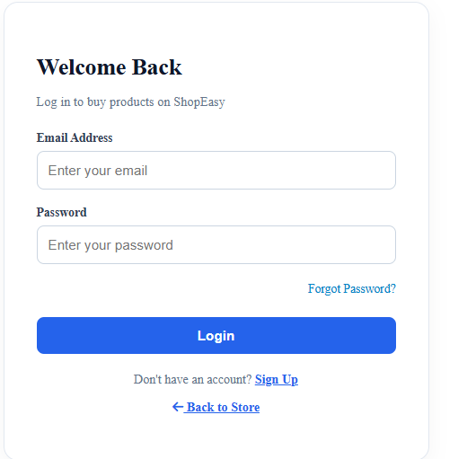
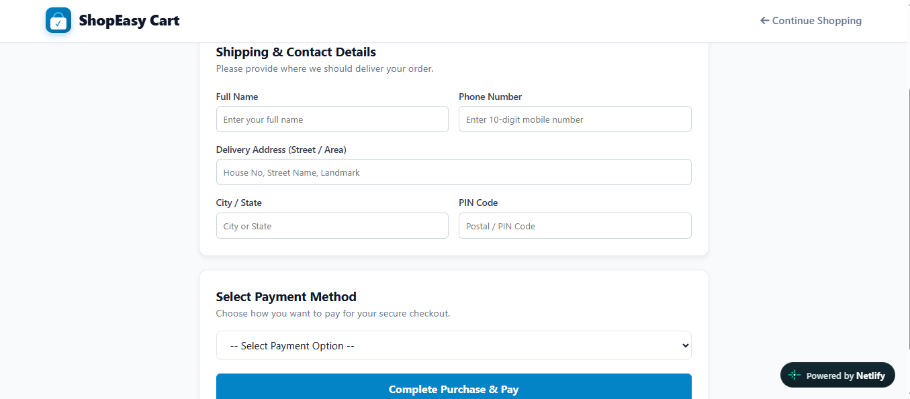
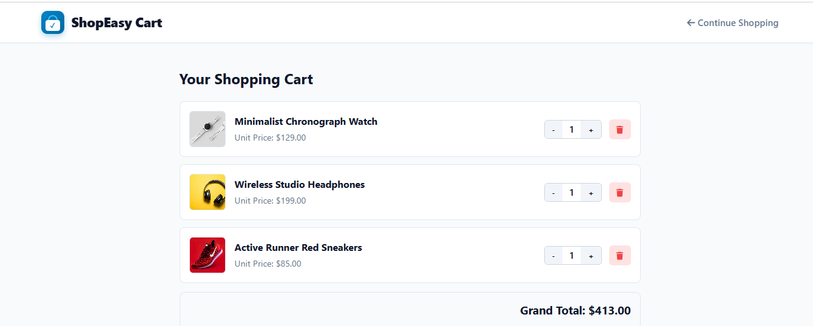
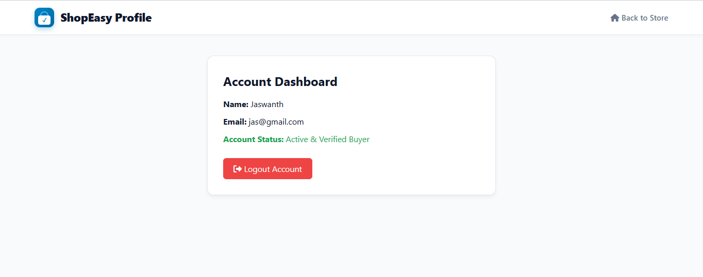

<div align="center">

# 🛍️ ShopEasy — Online Store

### A responsive front-end e-commerce website built with HTML, CSS & JavaScript

<p>
  <a href="https://shopeasy-onlinestore.netlify.app/">
    
  </a>
  
  
  
  
</p>

<p>
  <strong>🌐 Live Website:</strong>
  <a href="https://shopeasy-onlinestore.netlify.app/">shopeasy-onlinestore.netlify.app</a>
</p>

</div>

---

## 📌 About the Project

**ShopEasy** is a responsive front-end e-commerce website created to demonstrate practical web-development skills through a realistic online shopping experience.

The project includes product browsing, product details, authentication pages, cart management, user profile functionality, password reset flow, and browser-based data persistence.

It is deployed on **Netlify**, making the project publicly accessible for demonstration and placement/interview purposes.

> **Project type:** Front-end / static e-commerce application  
> **Deployment:** Netlify  
> **Data storage:** Browser `localStorage`  
> **Backend:** Not currently implemented

---

## 🚀 Live Demo

### 👉 [Open ShopEasy Online Store](https://shopeasy-onlinestore.netlify.app/)

You can use the live website to explore the interface and test the available shopping flows.

---

## ✨ Key Features

| Feature | Description |
|---|---|
| 🏠 **Home Page** | Responsive landing page for the online store |
| 🛍️ **Product Browsing** | Browse available products through the store interface |
| 🔎 **Product Details** | Dedicated product-detail experience |
| 🛒 **Shopping Cart** | Add, remove and update products in the cart |
| 🔐 **User Authentication** | Sign-up and login pages |
| 👤 **User Profile** | Profile/dashboard experience for logged-in users |
| 🔑 **Forgot Password** | Front-end password reset flow |
| 💾 **LocalStorage** | Persists demo user and cart data in the browser |
| 📱 **Responsive UI** | Designed for desktop and smaller screens |
| 🚀 **Netlify Deployment** | Publicly hosted live version |

---

## 🖼️ Project Preview

<div align="center">









</div>

---

## 🧰 Tech Stack

### Frontend
- **HTML5** — semantic page structure
- **CSS3** — styling, layouts and responsive design
- **JavaScript** — dynamic behaviour, DOM manipulation and application logic
- **Font Awesome** — UI icons

### Storage
- **Browser LocalStorage** — demo user, authentication state and cart persistence

### Deployment & Version Control
- **Netlify** — live deployment
- **Git** — version control
- **GitHub** — source-code repository

---

## 📂 Project Structure

```text
shopeasy-online-store/
│
├── README.md
│
├── index.html                 # Main store / home page
├── product-detail.html        # Product details
├── cart.html                  # Shopping cart
├── login.html                 # Login page
├── signup.html                # Registration page
├── forgot-password.html       # Password reset
├── profile.html               # User profile
│
├── css/                       # Stylesheets
│   ├── index.css
│   ├── login.css
│   ├── signup.css
│   └── forgot-password.css
│
├── js/                        # JavaScript functionality
│   ├── auth.js
│   └── cart.js
│
└── outputs/                   # Project screenshots
```

---

## 🔄 Application Flow

```text
             ┌──────────────────┐
             │   ShopEasy Home   │
             └────────┬─────────┘
                      │
          ┌───────────┴───────────┐
          ▼                       ▼
   Browse Products          Sign Up / Login
          │                       │
          ▼                       ▼
   Product Details          User Profile
          │
          ▼
      Add to Cart
          │
          ▼
    Update / Remove
          │
          ▼
       Cart Page
```

---

## 🔐 Authentication

The project contains a complete **front-end authentication flow** for demonstration:

1. User creates an account through the Sign Up page.
2. User credentials are stored in browser `localStorage`.
3. User can log in using the registered details.
4. Authentication state is maintained locally.
5. Logged-in users can access profile-related functionality.
6. Users can log out.
7. A front-end Forgot Password flow is provided.

### ⚠️ Security Note

This is a **learning/demo front-end project**. Passwords and user information are handled on the client side and should **not** be used for real customer accounts or production authentication.

A production version should use secure server-side authentication, password hashing, sessions/tokens, HTTPS and a protected database.

---

## 🛒 Shopping Cart

The shopping-cart functionality is implemented using JavaScript and browser storage.

Users can:

- Add products to the cart
- View selected products
- Change quantities
- Remove products
- Persist cart data within the browser

### Cart Flow

```text
Product
   ↓
Add to Cart
   ↓
Cart Storage
   ↓
Update Quantity
   ↓
Remove / Continue Shopping
```

---

## 💻 Run the Project Locally

### 1. Clone the repository

```bash
git clone https://github.com/Jaswanth-36/shopeasy-online-store.git
```

### 2. Open the project

```bash
cd shopeasy-online-store
```

### 3. Run

Open `index.html` in a browser.

For a better development experience, open the project in **Visual Studio Code** and use the **Live Server** extension.

---

## 🚀 Deployment

The live application is deployed through **Netlify**.

**Live URL:**  
https://shopeasy-onlinestore.netlify.app/

Because the project is a static front-end application, it can be deployed directly as a static site.

---

## 🎯 Skills Demonstrated

This project demonstrates practical experience with:

- Front-end web development
- HTML5 and CSS3
- JavaScript fundamentals
- DOM manipulation
- Event handling
- Browser LocalStorage
- Authentication UI and flow
- Shopping-cart logic
- Responsive web design
- UI/UX implementation
- Git and GitHub
- Netlify deployment
- Project documentation

---

## 🔮 Future Enhancements

The following improvements could transform ShopEasy into a full-stack production application:

- [ ] Build a secure backend API
- [ ] Add a database for users, products and orders
- [ ] Implement secure authentication and password hashing
- [ ] Add product search and filtering
- [ ] Add product categories
- [ ] Implement wishlist functionality
- [ ] Add persistent order history
- [ ] Integrate a payment gateway
- [ ] Create an admin dashboard
- [ ] Add product management
- [ ] Add customer/order management
- [ ] Improve accessibility and form validation
- [ ] Add automated testing

---

## 📊 Project Highlights

**ShopEasy** is designed as a portfolio project to demonstrate how a static front-end application can be structured like a real-world e-commerce website.

### What makes it portfolio-ready?

- ✅ Multiple connected pages
- ✅ Interactive JavaScript functionality
- ✅ Authentication flow
- ✅ Shopping-cart functionality
- ✅ Browser data persistence
- ✅ Responsive interface
- ✅ Live public deployment
- ✅ GitHub source-code repository
- ✅ Project screenshots and documentation

---

## 👨‍💻 Developer

**Jaswanth Neerukattu**

📌 **Project:** ShopEasy — Online Store  
🌐 **Live Demo:** https://shopeasy-onlinestore.netlify.app/  
💻 **GitHub:** https://github.com/Jaswanth-36/shopeasy-online-store

---

<div align="center">

### ⭐ If you found this project interesting, consider giving the repository a star!

**ShopEasy — Simple • Responsive • Interactive • Deployed**

</div>
